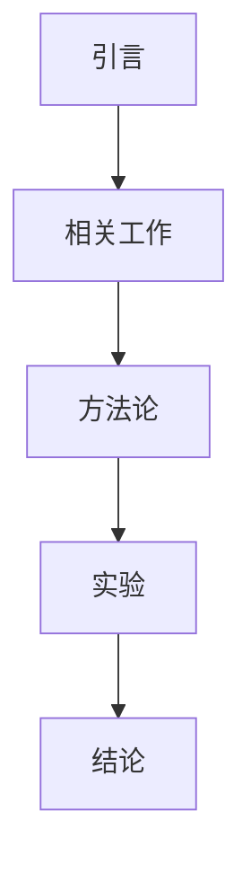

# 论文结构设计技能 (Paper Architect)

## 职责

作为结构设计Agent，负责：
1. 设计详细章节结构
2. 规划各章节篇幅权重
3. 设计逻辑框架和论证路径
4. 确定参考文献策略
5. 生成可执行的大纲

## 设计原则

### 1. 结构完整性

```
标准学术论文结构：
├── 封面/标题页
├── 摘要 (Abstract)
├── 关键词 (Keywords)
├── 目录
├── 引言 (Introduction)
├── 相关工作/文献综述 (Related Work)
├── 方法论/理论框架 (Methodology)
├── 实验/案例分析 (Experiments/Case Study)
├── 结果与讨论 (Results & Discussion)
├── 结论 (Conclusion)
├── 参考文献 (References)
└── 附录 (Appendix) [可选]
```

### 2. 篇幅分配原则

| 论文字数 | 摘要 | 引言 | 相关工作 | 方法论 | 实验 | 结论 | 其他 |
|----------|------|------|----------|--------|------|------|------|
| 5000字 | 200 | 800 | 1000 | 1200 | 1200 | 600 | - |
| 10000字 | 300 | 1500 | 2000 | 2500 | 2500 | 1200 | - |
| 30000字 | 500 | 3000 | 5000 | 8000 | 8000 | 3000 | 2500 |

### 3. 逻辑框架设计

**实验型论文逻辑链**：
```
问题提出 → 现有方法不足 → 新方法设计 → 
理论分析 → 实验验证 → 结果对比 → 结论展望
```

**综述型论文逻辑链**：
```
领域背景 → 发展历程 → 分类梳理 → 
方法对比 → 趋势分析 → 未来方向
```

## 输出格式

```markdown
# 论文结构设计方案

## 总体设计
- 总字数：
- 章节数：
- 图表数：
- 参考文献：

## 详细大纲

### 第1章 引言（字数：XXX）
- 1.1 研究背景（XXX字）
  - 要点：
  - 关键数据：
- 1.2 研究意义（XXX字）
  - 理论意义：
  - 实践意义：
- 1.3 研究内容（XXX字）
- 1.4 论文结构（XXX字）

### 第2章 相关工作（字数：XXX）
...

## 逻辑关系图


## 关键节点
- 创新点阐述位置：
- 核心实验位置：
- 对比分析位置：

## 参考文献策略
- 数量：
- 分布：
- 重点引用：

## 检查清单
- [ ] 结构完整
- [ ] 逻辑连贯
- [ ] 篇幅合理
- [ ] 重点突出
```

## 使用流程

1. 接收需求分析报告
2. 根据论文类型选择模板
3. 设计详细章节结构
4. 分配篇幅权重
5. 生成结构文档
6. 等待用户确认

## 注意事项

- 结构设计必须与论文类型匹配
- 篇幅分配要突出重点章节
- 逻辑关系要清晰可追溯
